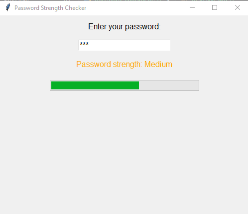

# Password Strength Checker

A simple **Password Strength Checker** built with Python and Tkinter. It provides real-time feedback on password strength based on various criteria.

## Table of Contents

- [Features](#features)
- [Requirements](#requirements)
- [Installation](#installation)
- [How to Run](#how-to-run)
- [Packaging the Application](#packaging-the-application)
- [How It Works](#how-it-works)
- [Example](#example)
- [License](#license)
- [Contributing](#contributing)

## Features

- Real-time password strength assessment with dynamic feedback.
- Password strength levels: `Weak`, `Medium`, `Strong`.
- Visual feedback with a progress bar that fills as the password strength increases.
- Tips on how to create a strong password.
- Built using Tkinter for a simple, intuitive GUI.

## Requirements

- Python 3.x
- `tkinter` (included with most Python installations)
- `re` (part of the Python standard library)

## Installation

1. Clone this repository or download the source code:

```bash
   git clone https://github.com/Judith-20/PRODIGY_CS_03.git
```

2. Navigate to the project folder:

```bash
cd password-strength-checker
```

## How to Run

1. Run the password_checker.py script:

```bash
python password_checker.py
```

2. The Password Strength Checker window will appear. Enter a password to receive real-time feedback on its strength.

## Packaging the Application

To bundle the script into a standalone executable using PyInstaller:

1. Install PyInstaller:

```bash
pip install pyinstaller
```

2. Create the executable:

```bash
pyinstaller --onefile --windowed password_checker.py
```

3. The executable will be located in the dist/ folder after the process completes.

## How It Works

The password strength is evaluated based on these criteria:

- At least 8 characters in length.
- Contains both uppercase and lowercase letters.
- Includes at least one number.
- Includes special characters like !, @, #, etc.

The strength is displayed as:

- **Weak:** Meets 1-2 criteria (progress bar in red).
- **Medium:** Meets 3-4 criteria (progress bar in orange).
- **Strong:** Meets all 5 criteria (progress bar in green).

## Example

Here's a screenshot of the Password Strength Checker in action:



## Contributing

Contributions are welcome! If you'd like to contribute to this project, please:

- Fork the repository.
- Create a new branch (git checkout -b feature-branch).
- Commit your changes (git commit -m 'Add feature').
- Push to the branch (git push origin feature-branch).
- Open a pull request.
